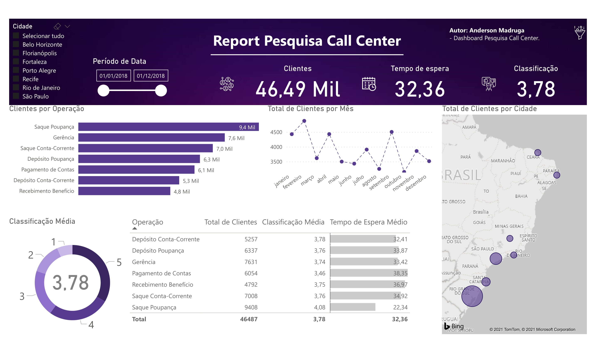
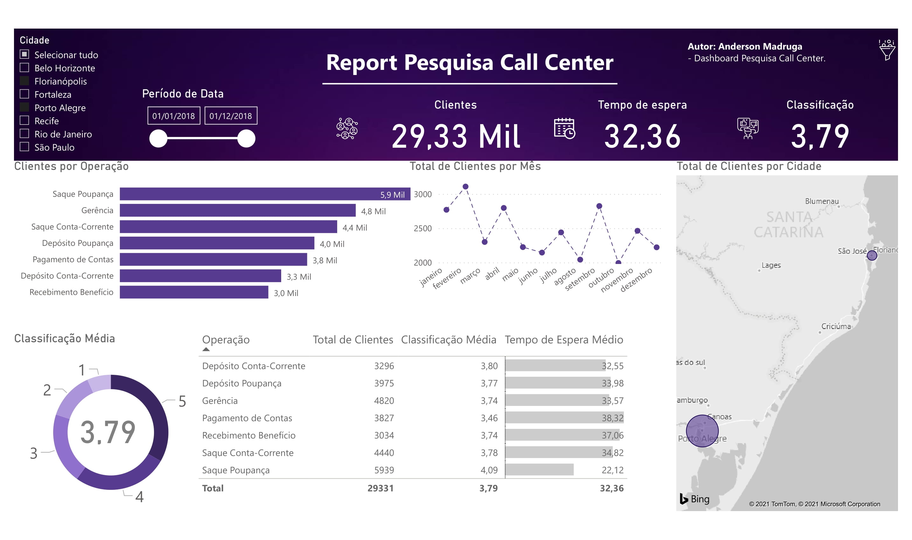
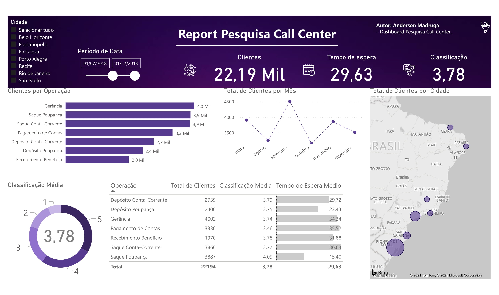
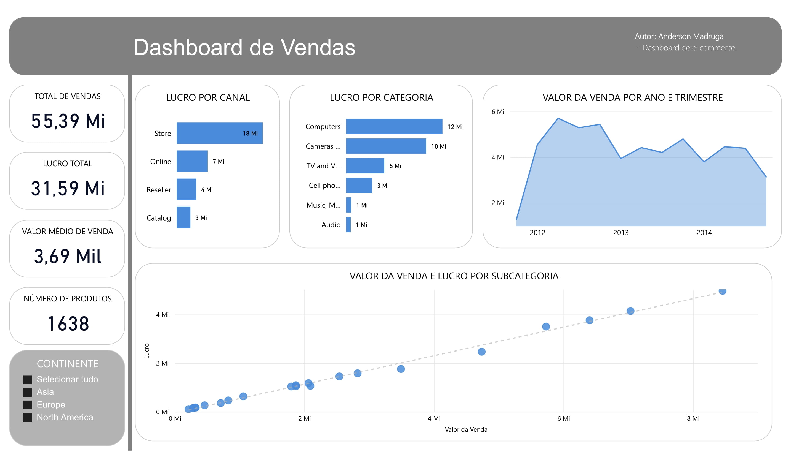
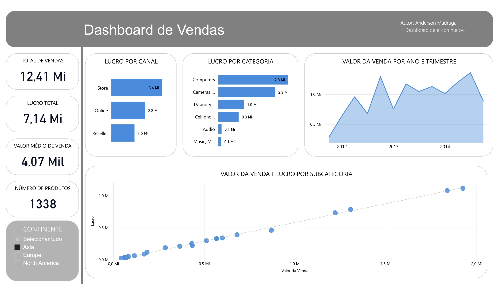
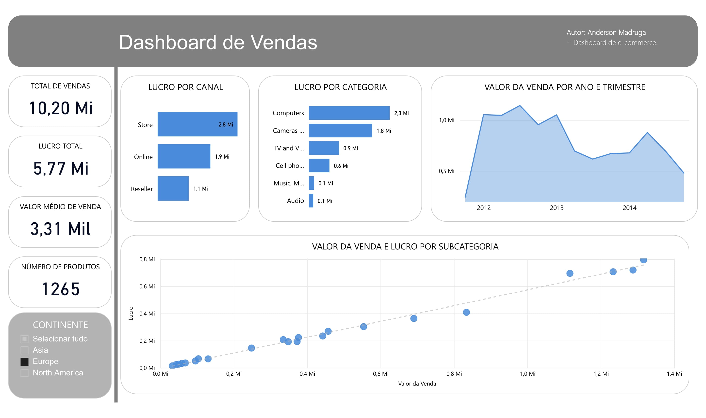
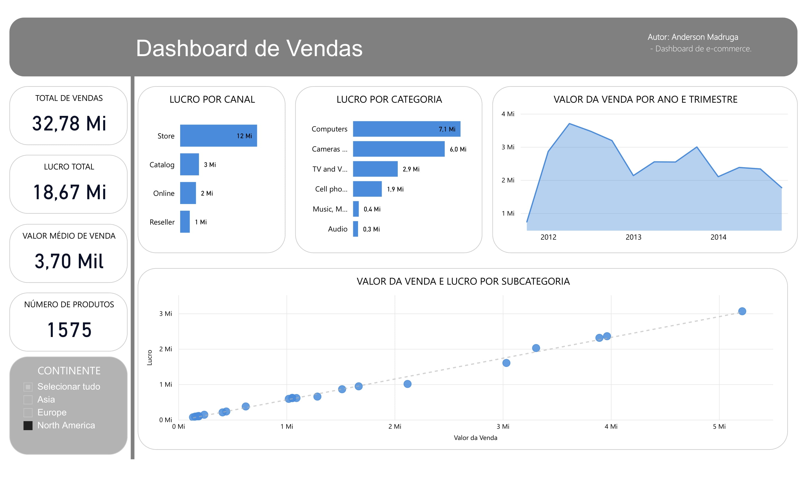

## Caso pesquisa de satisfação de um Call Center:

**SE VOCÊ DESEJA TER ACESSO AOS ARQUIVOS DE DADOS E PBIX, VOCÊ OS ENCONTRA AQUI:** [.xlxs](https://github.com/devmadruga/power_bi/blob/main/caso_loja/bd_loja.xlsx) e [.pbix](https://github.com/devmadruga/power_bi/blob/main/caso_loja/bi_loja.pbix). 

> Apresentando resultado para todas as cidades participantes:

> Filtrando os resultados por região - região Sul:

> Filtrando os por período - segundo semestre para todas as cidades participantes:

## Caso e-commerce:

> Todos os continentes:

> Filtrando os resultados para Ásia:

> Filtrando os resultados para a Europa:

> Filtrando os resultados para a América do Norte:

